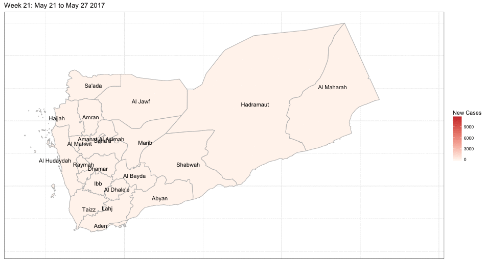

```{r setup, include=FALSE, echo=FALSE}
knitr::opts_chunk$set(echo = TRUE, warning=FALSE, message=FALSE)
```

## Background Information


## Data

```{r libraries}
library(tidyverse)
library(lubridate)
library(magrittr)
library(ggmap)
library(gridExtra)
library(gganimate)
source("simple-model-fits.R")
```

```{r data, cache=TRUE}
# Read in shapefile data
spatial <- list()
spatial$map <- readRDS("../data/yemen_map.rds")
spatial$shp <- readRDS("../data/yemen_shp.rds")
spatial$shpdf <- readRDS("../data/yemen_shpdf.rds")
spatial$info <- readRDS("../data/yemen_shp_info.rds")
# Read in daily timeseries and aggregate data into weeks
timeseries <- list()
timeseries$national <- readRDS("../data/timeseries-national.rds")
timeseries$governorate <- readRDS("../data/timeseries-governorate.rds")
change.names <- levels(timeseries$governorate$Governorate) %>% `[`(!(.%in%spatial$info$admin1Name_en))
timeseries$governorate$Governorate %<>% 
  as.character() %>%
  sapply(function (x) ifelse(x %in% change.names, "Hadramaut", x)) %>% 
  factor()
timeseries$national.weekly <- aggregate.by.week(timeseries$national)
timeseries$governorate.weekly <- aggregate.by.week(timeseries$governorate)
```


```{r combinedata, cache=TRUE}
spatiotemporal.governorate <- combine.spatiotemporal(spatial, timeseries$governorate.weekly)
```

```{r DataPlotsNational, width=5, height=4}
plot.weekly.ts(timeseries$national.weekly, title="Incidence of cholera in Yemen")
```

```{r DataPlotsGovernorate, fig.width=8, fig.height=12}
plot.weekly.ts(timeseries$governorate.weekly, 
               title="Incidence of cholera in Yemen governorates") +
  facet_wrap(~Governorate, ncol=3)
```


```{r SpatialPlotsGovernorate, fig.show="animate", fig.width=diff(range(spatial$shpdf$long))*0.5, fig.height=diff(range(spatial$shpdf$lat))*0.5, cache=TRUE}
spatiotemporal.governorate %>% 
  plot.spatiotemporal %>% 
  gganimate(filename="spatiotemporal.gif",
            ani.width=diff(range(spatial$shpdf$long))*75,
            ani.height=diff(range(spatial$shpdf$lat))*75)
```




